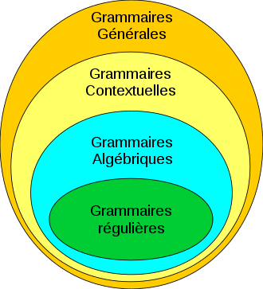

```{r setup, include=FALSE}
knitr::opts_chunk$set(echo = TRUE, warnings = FALSE)
library(knitr)
library(ade4)
library(FactoMineR)


#{\displaystyle w_{1}x_{1}+\ldots +w_{m}x_{m}=\sum _{j=1}^{m}w_{j}x_{j}.}
```

# Avant-propos

Ce dossier a été réalisé dans le cadre du module OPEN (Outils, perspectives et enjeux des numériques) dispensé à l'ISARA en 2025 et coordonné par M. PAYET. Ce dossier a pour but de présenter un travail de recherche sous-format R.Mark.Down pour nous familiariser à l'outil et justifier de compétences nécessaires abordées au cours de l'optionnel. 

Pour ce faire, nous allons réaliser un support d'information et d'explication sur le concept des *Expressions Régulières* communément appelé *Regex*, qui est utilisé dans plusieurs langages informatiques qui permettent l'identification de structures régulières au sein d'un texte. Puisque le module se fonde essentiellement sur du R, nous aborderons ce concept au travers de ce langage et ferons un état des lieux des possibles dans d'autres langages informatique. L'objectif à terme est de fournir un dossier qui permet l'apprentissage des Regex à toute personne en ayant besoin et en fournissant les différents codes adéquats à leur utilisation. 

Cette envie d'approfondir mes connaissances sur les expressions régulières provient de mon stage de 4ème année où j'ai été amené à réaliser une base de données à partir de questionnaires. Le réarrangement des données se faisait sur R et je me suis souvent retrouvé avec des problèmes de réponses dans les questionnaires. Une des manières de contrer ces problèmes de réponses incohérentes pouvait être le REGEX, puisqu'il permet de trier les informations qu'on souhaite selon une forme spécifique qu'on a pu lui attribuer.

# Le REGEX

## ...de l'Homme à la machine

Avant de parler des expressions régulières, nous devons parler d’anatomie. En effet, l’origine des expressions régulières se rapporte à la théorie des automates. Au cours des années 1940, Warren McCULLOCH et Walter PITTS souhaitent décrire le système humain par l’intermédiaire d’automates simples. En 1943, ils arrivent à décrire le neurone formel ou neurone McCullock-Pitts, une représentation mathématique et informatique du neurone biologique. A l’instar du biologique, ce neurone dispose d’une ou plusieurs entrées (dendrites) et une sortie (le cône d’émergence). C’est le début de la théorie des automates. L’ensemble est dirigé selon un modèle mathématique, fonctionnant avec des états binaires (0 ou 1), on peut considérer ce modèle comme un automate fini où chaque neurone est une unité logique activée selon des règles précises. @wikipedia_expression_2025
```{r pic1, echo=FALSE, out.width = '100%', fig.align = "center", fig.cap="Schéma comparatif neurone humain et artificiel"}

```

Peu de temps après, en 1945 John von Neuman va formaliser l’architecture des ordinateurs modernes. Il va appliquer la théorie des automates de McCulloch et Pitts pour les adapter aux ordinateurs réels. Dans les années 50, il est devenu nécessaire de décrire formellement les instructions à exécuter, ce qui a abouti aux premiers langages de programmation (Fortran, Algol) qui nécessitaient une grammaire bien définie. C’est alors que fut introduit la Théorie des Langages formels.  @george_histoire_2020


Langages formels = grammaires définies + automates pour les reconnaître.

## REGEX et type de langage 

Avant de parler de REGEX, il faut comprendre pourquoi on les a inventés et pour ce faire nous allons parler de langages. D’après la Hiérarchie de Chomsky, il existerait quatre types de grammaire, qui aboutissent à une famille de langage. @wikipedia_hierarchie_2024 et @salle_212_107_2021

-	Type 0 : **langage récursivement énumérable ou général** reconnaissable par une machine de Turing. Ils peuvent exprimer n’importe quel algorithme possible. En soit, l’algorithme peut comprendre toute forme de langage.

-	Type 1 : **langage contextuel** : reconnaissable par les automates linéairement bornés. Ils peuvent inclure des règles plus complexes où certaines parties d’une phrase influences d’autres. 

**Exemple concret d’application :** le correcteur grammatical.
Un exemple de règle que ces automates peuvent comprendre : pour le mot « ACCESSIBLE » , on sait que le E est sans accent, car la langue française nous interdit de mettre un accent s’il y a présence d’une double consonne (ici le « SS ») juste après. 

-	Type 2 : **langage algébriques ou hors contexte** : langages reconnaissables par les automates à pile. Ils permettent des structures plus complexes, comme les parenthèses imbriquées dans une phrase. 

**Exemple concret :** : une calculette ou une phrase bien formée en français. 
Ce type de langage est très bien présenter dans la plupart des langages de programmations. Parmi les règles qui permettent de présenter ce type de langage, cela va être tout ce qui est lié à la formation d’une « phrase ». 
Ici, on ne va pas s’intéresser au mot spécifiquement, mais à leur succession, leur assemblage dans la phrase. 
**Exemple typique** : « SUJET + VERBE + COMPLEMENT » ou bien toutes les conditions dans une fonction. 

-	Type 3 : **langages rationnels ou réguliers** reconnaissables par les automates finis. 

**Exemple concret :** Une machine à tourniquer qui reconnaît un jeton « A » ou « B » ou un détecteur de mots-clés. 
Ce type de langage permet de vérifier les caractéristiques lexicales d’un mot. Un exemple concret est la vérification de la forme d’un courrier électronique lors d’une identification. En effet, un courrier électronique est composé comme suit : exempleAROBASE.COM

```{r pic2, echo=FALSE, out.width = '100%', fig.align = "center", fig.cap="Schéma de la Hiérarchy de Chomsky"}

```

Globalement, tous les langages sont de types 0 et chaque type de langage est un cas particulier du type de langage supérieur. Par exemple, le langage de type 2 est un cas particulier du langage du type 1 au même titre que le type 3 est un cas particulier du type 2. Ainsi, plus on monte dans la hiérarchie, plus langage est puissant, mais aussi, plus il est complexe à analyser et à traiter. À l’inverse, plus on descend, plus le rajout de règles de restrictions des automates va amener à analyser des langages de plus en plus simples. @wikipedia_langage_2024
En 1956, Stephen COLE KLEENE, définira les expressions régulières (REGEX) comme appartenant au type 3. C’est le principe du Théorème de Kleene qui affirme qu’un langage est rationnel si et seulement s’il est reconnu par un automate fini. @wikipedia_theoreme_2024

Il faudra attendre 1959 pour que Michael Rabin et Dana Scott proposent un traitement mathématique de ces concepts, ce qui leur firent accéder au prix Turing en 1976. 


## De la théorie à la machine

Jusqu’aux années 1960, les expressions régulières étaient une construction mathématique utilisée en logique et en linguistique formelle. En 1968, Ken Thompson, alors chercheur chez Bell Labs, va les faire entrer dans l’univers de l’informatique. En se basant sur les travaux de KLEEN, Thompson va implémenter l’idée des expressions régulières dans l’éditeur de texte ed, pour que ses utilisateurs puissent effectuer des correspondances de modèles avancées dans des fichiers texte. Par la suite, il les intégrera dans l’éditeur grep pour « Global Regular Expression Print » sous Unix. C’est le début de l’utilisation des expressions régulières en informatique. @george_histoire_2020 et @jade_histoire_2020
Les expressions régulières sont largement utilisées dans  des utilitaires comme Iex et dans les langages de programmation nés sous Unix comme expr, awk, Perl, Tcl voire Python ou PHP. On les retrouve aussi sur R. 

## Utilisation du REGEX

A l'origine, les expressions régulières permettaient de décrire des langages formels. Aujourd'hui, elles sont utilisées dans diverses analyses et la manipulation des langages informatiques. L'une des applications les plus courantes est la validation des informations, données en lignes, par exemple sur la vérification du format standard d'une boite mail, d'un numéro de téléphone ou même si le mot de passe respecte les normes demandées par la plateformes @friedl_mastering_2006 . Dans le domaine de la cybersécurité, les REGEX sont largement utilisés pour détecter des modèles de texte malveillants dans des logs systèmes et identifier les adresses IP supsectes ou des tentatives de phishing @garfinkel_web_2002. Elles jouent également un rôle clé dans le **web scraping**, qui permettent d'extraire des informations précises de pages web à la manières des moteurs de recherches ou de logiciel d'analyses de donnée @mitchell_web_2018. En biu-informatique, les chercheurs s'en servent pour analyser des séquences d'ADN en identifiant des motifs spécifiques dans les génomes @durbin_biological_1998.
Aussi, les REGEX sont utilisées pour segementer des phrases, extraire des entités nommées et améliorer les performances des chatbots et assistancts vocaux @jurafsky_speech_2009.

# Syntaxe

La REGEX (regular expression) est une suite de caractères typographiques avec une syntaxe spécifique (le motif ou « pattern » en anglais) qui va décrire un ensemble de chaîne de caractères qui respecte cette syntaxe. Le but de la REGEX est de retrouver les occurrences dans un texte selon des règles que nous aurons définies. Comme présentée précédemment, la REGEX fait partie des langages de types 3, c’est-à-dire qu’on va s’intéresser à la forme du mot. La plupart des langages informatiques ont une syntaxe basée sur les expressions régulières de PCRE (Perl Compatible Regular Expressions, qu’on retrouve dans le Python, le JavaScript, le PHP, le Java… Chacun de ces langages aura des spécificités, mais ici, on s’intéressera principalement au PCRE en guise d’exemple pour analyser la structure typique d’une REGEX puis nous détaillerons notre guide d’utilisation des REGEX uniquement sur R. @bandes_de_codeurs_107_nodate

Afin d’illustrer la structure typique des REGEX sous PCRE, nous allons étudier le cas d’un exemple : un mail ISARA.

Un mail ISARA est construit de la sorte : 

1ère lettre du prénom + nom de famille @ (indicateur : etu ou alumni…) . isara . fr

Pour survoler la majorité des notions, on admettra qu’il existe des etu.isara et des alumni.isara. 

Une REGEX pour savoir si c’est bien une adresse mail isara serait en PCRE :

[a-z]+@(etu|alumni)?\.?isara\.fr

## La notion de *Pipe* 

Le « pipe » se symbolise par un « | ». Il permet de définir la condition « OU ». Ainsi « etu|alumni » permet de prendre en compte le « etu » ou le « alumni » pour les indicateurs supplémentaires d’un mail ISARA.

## La notion de *Range* 

Le « Range » est un tableau qui se caractérise par le premier et derniers caractères spécifiques d’une suite logique séparée par un tiret. Il s’écrit de la sorte par exemple : « [a-z] ». Cette REGEX permet de récupérer l’ensemble des lettres minuscules. Ici, on remarque qu’elle utilisait à deux reprises au début pour récupérer tous les noms et prénoms. 

-	[a-z] : Toutes les lettres minuscules

-	[A-7] : Toutes les lettres majuscules

-	[0-9] : Tous les chiffres

-	[a-zA-Z0-9] : Toutes les minuscules, majucules et les chiffres

-	…

## La notion de *Quantificateur* 

Le Quantificateur définit le nombre de fois que le « Range » ou toute conditions doit être répétées. Dans notre cas d’adresse mail ISARA, le « + » signifie « 1 ou plusieurs répétitions », ce qui permet de récupérer des adresses mail de toutes tailles. On le trouve aussi avec le « ? » qui signifie « 0 ou 1 répétition ». Il existe aussi « * » dans le cas de « 0 ou plusieurs répétitions ». 

Aussi, les quantificateurs peuvent être normés, avec des valeurs minimales et maximales de répétitions.

-	{n} : pour un nombre « n » précis de répétition

-	{n, m} : pour un nombre de répétitions comprises entre « n » et « m » inclus.

-	{n,} : pour au moins « n » répétitions. 


## La notion de *Capture* 

La « Capture » permet de capturer et de récupérer dans le code, une REGEX particulière. Cette capture est symbolisée par deux parenthèses « () ». Pour le cas « (etu|alumni) », la capture permet de signifier qu’on ne cherche que les « etu » ou « alumni » à cet endroit spécifique du mail, c’est-à-dire après le «@ ». Dans notre cas, elle n’est pas obligatoire puisqu’on a dispose d’un « ? » juste après.


## Les REGEX sous R : 

Ici, nous vous proposerons un catalogue de l’ensemble des fonctionnalités des REGEX sur R. Ces fonctionnalités sont issues d’un cours de l’Université Lyon 2, proposé par Ricco Rakotomalala. On tentera d’ailleurs d’effectuer un exemple à partir de ces regex pour trouver tous les mails ISARA comme nous avons fait sous PCRE.
Parmi les fonctions de R qui exploitent les expressions régulières, nous pouvons noter : 

-	Localisation de texte : grep, grepl, regexpr, gregexpr

-	Substitution de texte : sub, gsub

-	Découpage de texte : strsplit


```{r tab1, echo=FALSE, out.width = '100%', fig.align = "center", fig.cap="Liste de REGEX possibles sous R (partie 1)"}
knitr::include_graphics("Tab_REGEX_1.PNG")
```

```{r tab2, echo=FALSE, out.width = '100%', fig.align = "center", fig.cap="Liste de REGEX possibles sous R (partie 2)"}

```

```{r tab3, echo=FALSE, out.width = '100%', fig.align = "center", fig.cap="Liste de REGEX possibles sous R (partie 3)"}

```

En nous inspirant des tableaux préexistant, on peut créer une REGEX qui permet de gérer le format des mails ISARA. Néanmoins, il faut bien mettre en garde que cette REGEX ne peut qu'affirmer une formme. C'est pourquoi des mails qui représentent entièrement des nom comme "jeandupont[AT]isara.fr" seront aussi pris en charge dans la REGEX. En effet, la REGEX ne permet pas de différencier le prénom du nom, puisqu'elle s'intéresse exclusivement à la composition des "mots" des chaînes de caractères et non à leur sens. 
Cela signifie qu'un email comme "xyz[AT]isara.fr", bien que techniquement valide selon la structure REGEX, ne garantit pas qu'il corresponde à une adresse réellement attribuée par l'ISARA. 

Ainsi, la REGEX ne fait que mettre en exergue les occurences d'une structure syntaxique spécifique. Toutefois, elle demeure un outil puissant pour effectuées un premier filtrage des données dans des jeux de données conséquents. 


```{r REGEX_PCRE, echo=TRUE, eval=TRUE}

REGEX <- "^[a-z]+@((etu|alumni)\\.)?isara\\.fr$"

regex <- "^[[:lower:]]+@((etu|alumni)\\.)?isara\\.fr$"

emails <- c("prenomnom@isara.fr", "prenom.nom@etu.isara.fr", "prenom@alumni.isara.fr,", "jeandupont@isara.fr" , "mariecurie@etu.isara.fr", "paulvalery@alumni.isara.fr",
  "louise.moreau@etu.isara.fr", "henribertrand@isara.fr", "alice@isara.com",
  "maxime-dupont@isara.fr", "leo@etu.isara.fr", "sophie.martin@alumni.isara.org",
  "pierre@etuisara.fr")

#Permet d'appliquer la REGEX avec grepl
grepl(REGEX, emails)

grepl(regex, emails)


#Sommer le nombr d'occurence qui respecte la REGEX établie
print(sum(grepl(REGEX, emails)))

print(sum(grepl(regex, emails)))


```

## Bibliographie

Liste des publications :

