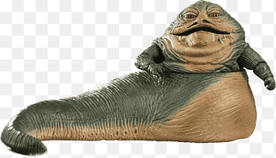

```{r setup, include=FALSE}
knitr::opts_chunk$set(echo = TRUE, warnings = FALSE)
library(knitr)
library(ade4)
library(FactoMineR)
```


# Introduction

Dans le cadre du module OPEN dispensé à l'ISARA en 2025, nous avons été amené à découvrir de nouvelles fonctionnalités sur R. Parmi les packages découvert ce matin 04 février 2025, nous avions *ggplot2* ainsi que *dplyr*. Bien que déjà abordé au cours de la **seconde et troisième année**, nous avons pu expérimenter quelques fonctionnalités de ces packages. Ainsi, et pour présenter le travail effectué en cette matinée, nous allons présenter sous la forme d'un PDF l'exercice effectué.
L'objectif de cette exercice était de réaliser ***le graphique le plus complexe possible***.


# Imports

Les données utilisées sont issues des données disponibles sur R dansl le packages *dplyr*. Dans un premier temps nous allons donc installer les packages avec puis les importer. 

```{r imports, echo=TRUE, eval=TRUE}
#install.packages("dplyr")
#install.packages("ggplot2")

library(ggplot2)
library(dplyr)
data("starwars")
```

# Présentation

Tout d'abord, il est nécessaire de réaliser un premier état des lieux des données. Pour ce faire nous allons utiliser la fonction head()

```{r sites, echo=TRUE, eval=TRUE}
head(starwars)
```

On remarque nous avons affaire à une table remplie de nombreuses informations de différents personnages de la saga "Star Wars". Parmi les informations fournies, nous avons : le nom, la taille, le poids, la couleur de cheveux, la couleur de peau, la couleur des yeux, le sexe, le genre, l'origine (homeworld), l'espèce ainsi que les fils où ils sont présent, leurs véhicules et leurs vaisseaux.

Nous avons donc ici `r ncol(starwars)` caractéristiques de `r nrow(starwars)` personnages.

# Méthodes et démarches

## Le support de notre étude principale

On va une analyse assez simple car l'objectif c'est plus de perdre lecteur que de faire une analyse profonde. 
Pour ce faire, un simple plot qui met les espèces en abscisses en fonction de leur masse pourrait convenir. On va déjà voir ce que ça donne : 

```{r premiere_vision, echo=TRUE, eval=TRUE}
  ggplot(starwars, aes(x = species, y = mass, fill = species)) +
  geom_jitter(aes(color= species), width = 0.2, size = 3, alpha=0.7)+
  ggtitle("Analyse de la masse des personnages de Star Wars")+
  labs(subtitle= "Comparaison par espèce",
  x = "Espèce", y = "Masse (kg)", fill = "Couleurs des Espèce")
```


## Dégrader le visuel

Maintenant qu'on a déjà une visualition confuse des données, on va renforcée la difficulté de lire à partir de différentes commandes. Les explications de chaque ligne sont présentes dans le code.
On va grossir les points car on arrive trop à les distinguer.
Dans un second temps on change la police à 14 ensuite on va personnaliser les axes et les affichages. Afin de rester la typologie et les couleurs de star wars, on va mettre le fond en noir et mettrre le titre et le sous-titre en jaune.
Pour l'axe X, on met le texte à 45 degrés pour faire chevaucher les différents textes qui contiennent le nom des espèces.
On va mettre un fond rouge et une écriture en cyan pour les textes. L'objectif est de rendre illisible, et difficile à regarder le graphique.

```{r deuxieme_vision, echo=TRUE, eval=TRUE}
ggplot(starwars, aes(x = species, y = mass, fill = species)) +
  geom_jitter(aes(color= species), width = 0.2, size = 5, alpha=0.7)+
  ggtitle("Analyse de la masse des personnages de Star Wars")+
  labs(subtitle= "Comparaison par espèce",
  x = "Espèce", y = "Masse (kg)")+
  theme_minimal(base_size = 14)+
  theme(axis.text.x = element_text(angle=45, hjust =1, face="bold",color="white"),
  axis.text.y = element_text(face="bold", color= "white"),
  plot.background = element_rect(fill = "black"),
  panel.background = element_rect(fill="black"),
  legend.background = element_rect(fill="red"),
  legend.text = element_text(color = "cyan"),
  legend.title = element_text(face = "bold", color= "white"),
  plot.title = element_text(face = "bold", size = 20, color = "gold"),
  plot.subtitle = element_text(face = "italic", size = 14, color = "gold"))+
  theme_minimal(base_size = 14)+
  theme(axis.text.x = element_text(angle=45, hjust =1, face="bold",color="white"),
  axis.text.y = element_text(face="bold", color= "white"),
  plot.background = element_rect(fill = "black"),
  panel.background = element_rect(fill="black"),
  legend.background = element_rect(fill="red"),
  legend.text = element_text(color = "cyan"),
  legend.title = element_text(face = "bold", color= "white"),
  plot.title = element_text(face = "bold", size = 20, color = "gold"),
  plot.subtitle = element_text(face = "italic", size = 14, color = "gold"))
```

## Un petit test de biblio 

En vitesse et pour montrer la compréhension voici deux petites références biblios selon le thème de des données @noauthor_star_2025.
D'ailleurs, le point vert qui est tout en haut est lié à un personnage très charismatique "Jabba" dont sa page wiki de fan est disponible ici. @noauthor_jabba_nodate

```{r logo, echo=FALSE, out.width = '50%', fig.align = "center", fig.cap="Fig. 1: Jabba sur un échiquier"}

```

## Bibliographie

Liste des publications :

